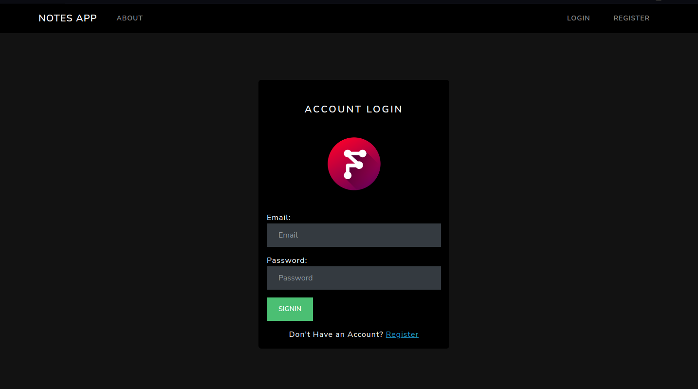

# Notes App NodeMongo

This is a basic Web application to manage simple Notes on the web using Javascript Technologies like Nodejs, Mongodb, and other related technologies. Tecnically this is a Multi-Page Application using Handlebars as template engine.

This app can do:

- CRUD Operations: create/read/update/delete Notes
- Allows a user to do login and save his personal notes




### Installation

```sh
git clone https://github.com/FaztTech/nodejs-notes-app
cd nodejs-notes-app
npm i
npm run dev # run in development mode
npm start # run in production mode
```

